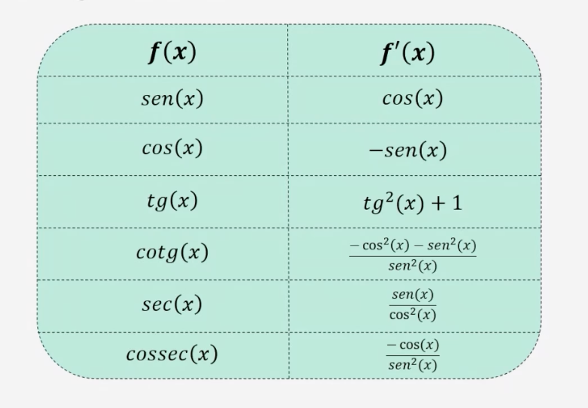
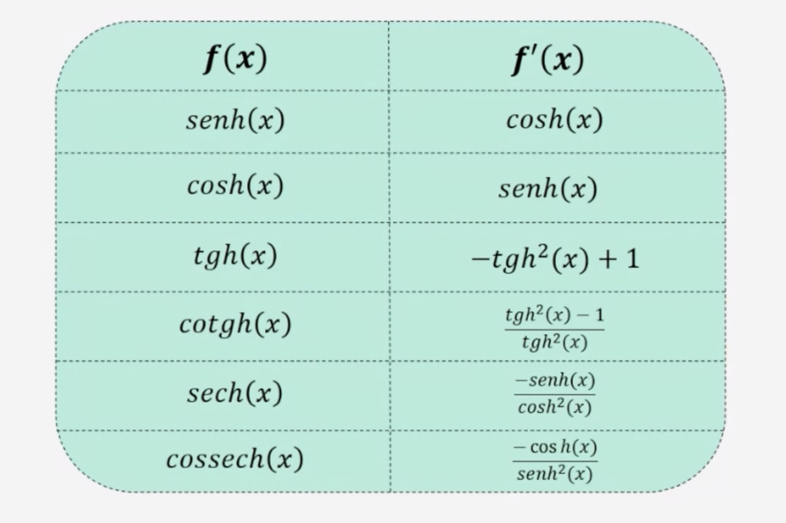

# Derivadas Elementares

## Derivada Exponencial
- Calculando a derivada de h(2) = 2 . e^x:
  - (f(x) . g(x))' = f'(x) . g(x) + f(x) . g'(x)
  - f(x) = 2 -> f'(x) = 0
  - g(x) = e^x -> g'(x) = e^x
  - h'(x) = 0 . eˆx + eˆx . 2
  - h'(x) = 2 . eˆx

- Calculando a derivada de f(x) = 2ˆx:
  - f(x) = 2ˆx
  - f(x) = (e^ln2)ˆx
  - f(x) = eˆx.ln2
  - u = x.ln2
  - y = eˆu

## Derivadas Hiperbólicas

