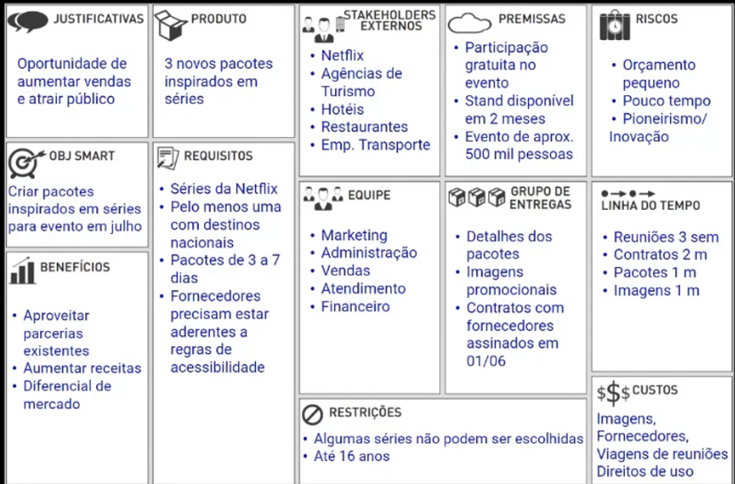

### Canvas de gestão de projetos 

**Como funciona?** __5w2h__
- WHAT (O que será feito?)
- WHY (Por que será feito?)
- WHO (Quem fará?)
- WHEN (Quando será feito?)
- WHERE (Onde será feito?)
- How (Como será feito?)
- How much (Quanto custará?)

*Porque será feito ?*
- Justificativas 
- Objetivo **SMART** 
  - Específico
  - Mensurável
  - Atingível
  - Relevante
  - Temporal (dentro de um prazo)
- Benefícios (futuro)

*O que será feito ?*
- Produto
- Requisitos 

*Por quem será feito ?*
- Stakeholders e fatores externos
- Equipe 

*Como será feito ?*
- Premissas
- Grupos de entregas
- Restrições

*Quando será feito ? e Quanto vai custar ?*
- Riscos
- Linha do tempo 
- Custos

**Benefícios**
- Simples de aplicar 
- Traz clareza e alinhamento
- Foco nas ações
- Gestão de diversar áreas
- Planejamento, controle e organizaçãp
- Da estratégia à execução

*Exemplo:*

