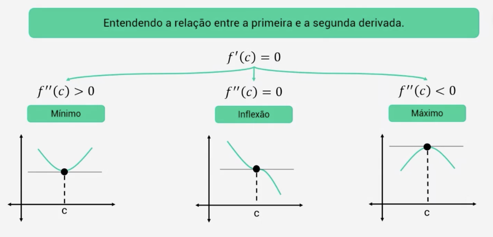
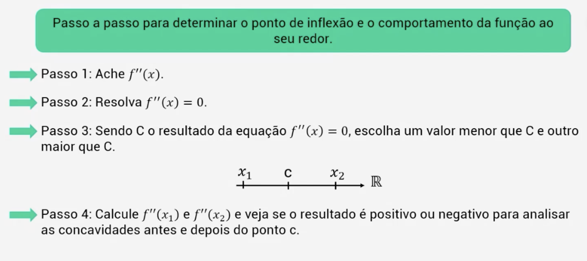

# Extremos, Concavidade e Inflexão

## Critérios para determinar os extremos de uma função
- Quando estamos falando de extremos de uma função, estamos falando dos pontos máximos e mínimos da função. Várias funções têm pontos máximos e/ou mínimos e, uma das formas de se verificar e obter estes pontos máximos e mínimos é por meio da construção do gráfico da função e a identificação destes pontos.

- Para determinar os extremos de uma função, é necessário verificar a derivada da função. A derivada da função é a tangente da função. A tangente da função é a reta que tangencia a função em um determinado ponto. A tangente da função é a reta que passa por um ponto da função e tem a mesma inclinação da função neste ponto.

## Concavidade e Pontos
- A concavidade de uma função descreve a curvatura de seu gráfico, podendo ser para cima (côncava) ou para baixo (convexa). Para determinar se um ponto crítico é de máximo ou mínimo, analisamos a derivada da função. Se a derivada for estritamente crescente em um intervalo, a função tem concavidade para cima e o ponto crítico é de mínimo. Se for estritamente decrescente, a concavidade é para baixo e o ponto é de máximo.

- Por exemplo, na função \(f(x) = x^3 - 3x\), os pontos críticos são \((-1, 2)\) e \((1, -2)\), sendo o primeiro um máximo e o segundo um mínimo. Já na função \(f(x) = x^4 - 3x^2\), os pontos críticos são \((-1.22, -2.25)\), \((0, 0)\) e \((1.22, -2.25)\), onde os pontos extremos laterais são mínimos e o ponto central é um máximo. A análise da concavidade garante a identificação correta desses extremos.

## Inflexão nos Gráficos
- Os pontos de inflexão em gráficos de funções são locais onde ocorre uma mudança na concavidade, passando de côncava para cima para côncava para baixo, ou vice-versa. Esses pontos são importantes para entender a variação da curvatura no gráfico da função e identificar transições no comportamento da curva.

- Por exemplo, na função \(f(x) = x^3 + 1\), o ponto de inflexão está em \((0, 1)\), onde a concavidade muda de para baixo (quando \(x < 0\)) para para cima (quando \(x > 0\)). Já na função \(f(x) = x^4 - 2x^2\), os pontos de inflexão são \((-0.58, -0.56)\) e \((0.58, -0.56)\), representando mudanças opostas na concavidade em cada ponto. Esses pontos marcam a transição da curvatura no gráfico, indicando variações no comportamento da função.

### Critérios para determinar os extremos de uma função

# Inflexão e Problemas de Maximização e Minimização
- Os pontos de inflexão são pontos em que uma função muda a concavidade, podendo passar de côncava para cima para côncava para baixo ou vice-versa. Eles são fundamentais na análise de gráficos, pois indicam onde ocorrem mudanças no comportamento da função. Além disso, quando uma função possui um ponto de inflexão, isso significa que ela pode ter pontos de máximo e mínimo próximos.

